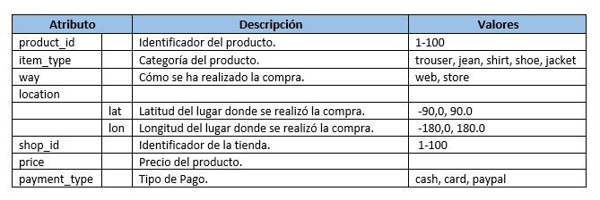

# Proyecto de Análisis de Datos para Empresa de Retail, Tiendas físicas y venta online

Este repositorio contiene un programa Spark 2.x desarrollado en Python para analizar datos de compras y stock de una empresa del sector del Retail. La empresa tiene presencia a nivel mundial, con sede en España, y opera tanto en tiendas físicas como en venta online.

La plataforma logística envía todos los días un archivo stock.csv con el stock de cada producto:

## Descripción del Problema

La empresa recibe diariamente un archivo llamado `purchases.json` con las compras realizadas en todo el mundo, donde cada línea del fichero representa una compra de una unidad del producto correspondiente. Además, la plataforma logística envía diariamente un archivo `stock.csv` con el stock de cada producto.

## Tareas a Resolver

El programa Spark debe resuelve las siguientes tareas:

1. **Los 10 productos más comprados.**
2. **Porcentaje de compra de cada tipo de producto (item_type).**
3. **Obtener los 3 productos más comprados por cada tipo de producto.**
4. **Obtener los productos que son más caros que la media del precio de los productos.**
5. **Indicar la tienda que ha vendido más productos.**
6. **Indicar la tienda que ha facturado más dinero.**
7. **Dividir el mundo en 5 áreas geográficas iguales según la longitud (location.lon) y agregar una columna con el nombre del área geográfica.**
    - ¿En qué área se utiliza más PayPal?
    - ¿Cuáles son los 3 productos más comprados en cada área?
    - ¿Qué área ha facturado menos dinero?
8. **Indicar los productos que no tienen stock suficiente para las compras realizadas.**
## Métodos de Resolución

Se responde a las preguntas utilizando tanto el DataFrame API como el lenguaje SQL.
Se implementa python utilizando Spark 2.x.

